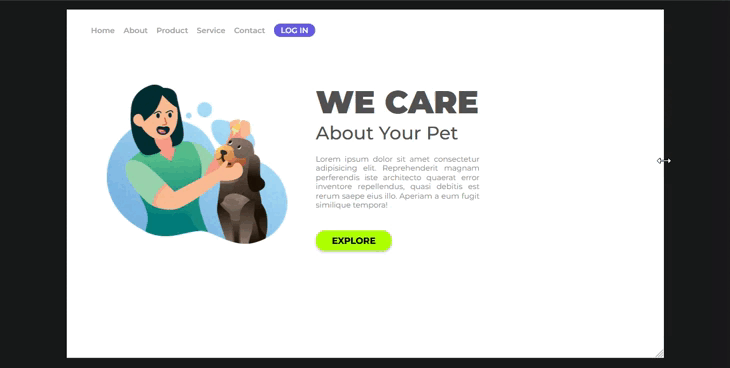
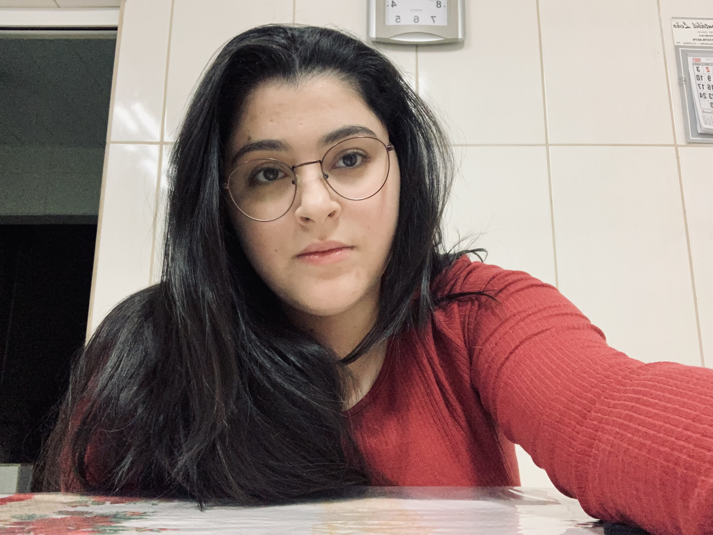

# We Care - Interface Responsiva

A interface do projeto foi criada para o aprofundamento em interfaces responsivas, além de colocar em prática os aprendizados de HTML e CSS.

## 🔧 Objetivos do Projeto

### Objetivo 01:

- Criar uma interface com HTML e CSS.

### Objetivo 02:

- Deixar a interface responsiva.

## Feito Com:

## 🤝 Contribuição

Agradecemos às seguintes pessoas que contribuíram para este projeto:

<table>
  <tr>
    <td align="center">
      <a href="#">
         
        
          <b>Amanda Saporiti</b>
        
      </a>
    </td>
  </tr>
</table>

[⬆ Voltar ao topo](#we-care-interface-responsiva) 
